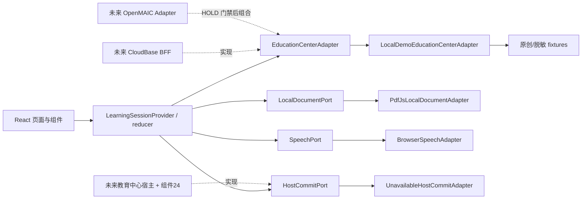
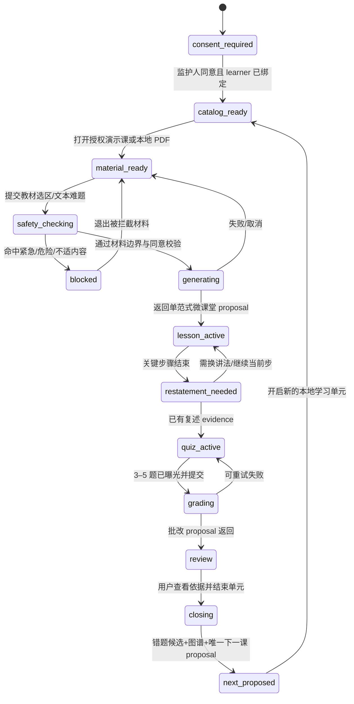
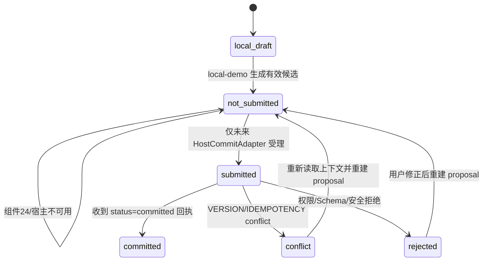
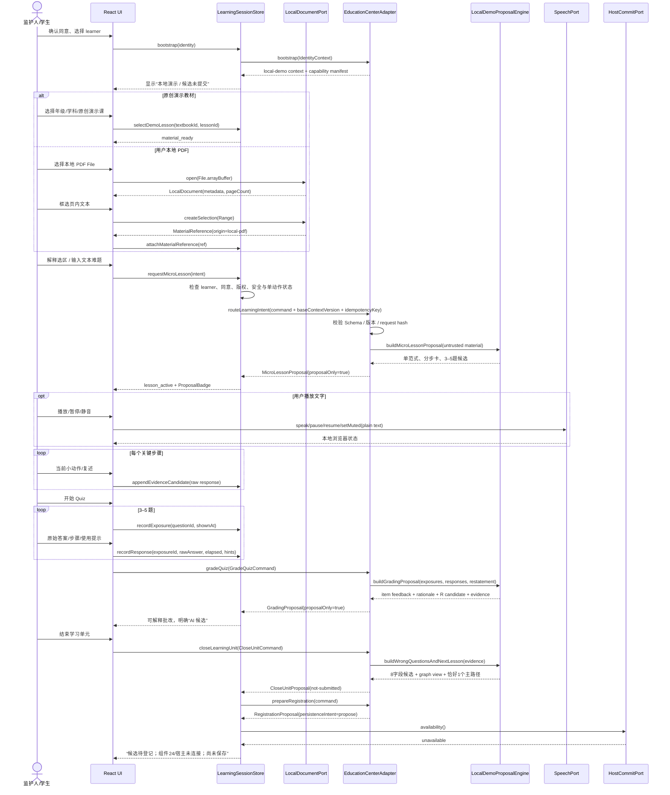
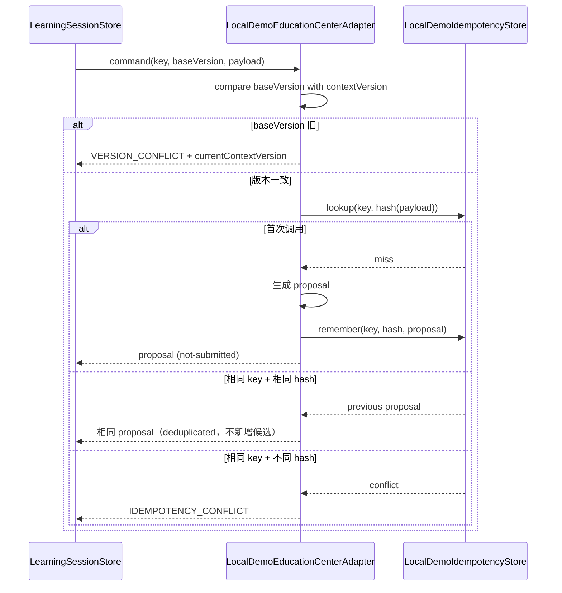

# AI 教育 Web App 本地受控 MVP：系统架构

> 文档状态：供 MVP 实现使用  
> 架构范围：`/Users/xiacg/WorkBuddy/教育中心/webapp`  
> 需求基线：`docs/PRD.md`  
> 集成事实基线：C2.1 Phase 3 验收报告与 `phase03-policy.json`  
> 重要声明：本文设计的是**本地可交互、proposal-only 的受控演示**，不是正式教育中心 registry、`kernel-10` 新路由或学习状态写入已经上线的声明。

## 1. 目标、边界与关键决策

### 1.1 MVP 必须跑通的唯一主旅程

选择原创演示教材或用户本地 PDF → 选取教材上下文/输入文本难题 → 分步微课堂 → 完成 3–5 题可视化 Quiz → 查看可解释批改 proposal → 形成统一 8 字段错题候选 → 查看知识图谱 → 获得唯一下一课 proposal。

全程必须满足：

- 一次只突出一个当前学习动作；
- 所有生成结果标记为“本地演示候选 / 尚未提交”；
- 没有真实宿主 commit 回执时，绝不显示“已保存、已归档、已掌握、已入队”；
- 正式调度权仍只属于 `kernel-10`；前端不含路径裁决规则；
- 本地 PDF 只在浏览器内存和 PDF.js worker 中处理，不上传、不写入持久存储；
- 本地增强版提供浏览器内图片拍题/OCR，可校对后作为不可信材料；原图和未确认草稿不上传、不持久化；
- 25/34 关闭，26/37 HOLD，35/36 仅“能力已合并、未正式激活”。

### 1.2 技术栈选择

采用 **Vite + React 18 + TypeScript + MUI + CSS Modules/CSS 自定义属性**，不在首版加入 Tailwind。

| 选择 | 原因 | 权衡 |
|---|---|---|
| Vite + React + TypeScript | 单页本地应用启动快；类型契约可约束 proposal、证据、版本与状态文案 | 不引入 SSR；本地 MVP 无 SEO 需求 |
| MUI | 提供键盘、焦点、表单、抽屉、对话框等成熟无障碍基础；主题可承载指定色板 | 不使用默认“后台卡片堆叠”视觉，统一由主题和 CSS Modules 改造成 Editorial 语言 |
| CSS Modules + CSS variables | 三栏/移动任务轨道是少量高定制度布局；与 MUI theme 配合直接、依赖更少 | 相比 Tailwind 少了工具类速度，但避免 MUI + Tailwind 双体系的优先级、reset 和维护成本 |
| React Context + `useReducer` | 状态规模有限；便于把 learner 隔离、状态机转移写成纯函数并测试 | 若未来跨页面实时同步显著扩大，再评估 Zustand/Redux Toolkit；MVP 不先抽象 |
| PDF.js (`pdfjs-dist`) | 浏览器端读取、渲染、文本层和选区锚点成熟；不需要上传 | 必须显式打包 worker、限制文件大小/页数并关闭脚本求值能力 |
| Zod | 运行时校验 local-demo fixtures、adapter 输入输出、导出数据与未来 BFF 响应 | 与 TS 类型存在少量重复，但跨适配器边界不能只依赖编译期类型 |
| `@xyflow/react` | 快速实现可缩放桌面图谱与聚焦路径；节点可做键盘可达 | 移动端默认使用可访问的路径列表，完整画布只是次级视图 |
| Web Speech API | 满足浏览器本地 TTS、播放/暂停/静音；没有音频上传 | 浏览器声音质量与 pause 支持存在差异，文字始终是等价主内容 |

Tailwind 在 PRD 中是默认建议而不是业务能力。首版省略它能减少一套样式 reset、构建插件和 class 规范，保持 MUI theme 为唯一设计 token 来源。如果团队坚持 Tailwind，只允许用于无组件语义的布局 utility，禁止复制 MUI 颜色/间距 token；这不是首选实现。

### 1.3 架构模式

采用 **分层前端 + Ports and Adapters（六边形边界）+ 单向状态流**：

1. **Presentation**：页面、组件、主题与响应式布局；只展示状态，不做教育调度。
2. **Application**：`LearningSessionProvider`、reducer、状态机与用例 hooks；编排 UI 操作，但不写 C2.1 决策规则。
3. **Domain/Contracts**：身份、教材、证据、Quiz、错题、图谱、下一课和 API envelope 的唯一类型/Schema。
4. **Ports**：`EducationCenterAdapter`、`HostCommitPort`、`LocalDocumentPort`、`SpeechPort`。
5. **Adapters**：P0 只启用 `local-demo`；未来 CloudBase/BFF 与 OpenMAIC 必须以新 adapter 接入，不允许页面直接访问供应方/API。



**权威关系不是部署状态：**`schedulerAuthority="kernel-10"` 表示契约权威；`executionMode="local-demo"` 表示本次并未命中正式 kernel route。local-demo adapter 是唯一的演示 proposal 生成位置，但不得被命名或展示成真实 `kernel-10` 已运行。

## 2. 模块边界

### 2.1 UI 与应用层

| 模块 | 职责 | 禁止事项 |
|---|---|---|
| `app/` | 路由、provider 装配、能力/运行模式全局横幅；仅 `AppProviders` 是具体 adapter 的 composition root | 除 `AppProviders` 外不直接 import 任一具体 adapter |
| `state/` | learner-keyed session state、纯 reducer、状态机守卫、临时 sessionStorage 元数据 | 不保存 PDF ArrayBuffer、全文、选区正文或“已提交”假状态 |
| `features/library/` | 年级/学科/教材/章节选择和授权状态 | 目录可用/不可用内容不得打开全文 |
| `features/classroom/` | 桌面 18/54/28 学习桌与移动底部任务轨道 | 不自行选择范式/路径 |
| `features/reader/` | 演示教材阅读、本地 PDF 导入、渲染、文本选区 | 不接受 URL PDF；不上传；不执行 PDF JavaScript |
| `features/lesson/` | 分步卡、快捷提问、复述、文字题输入、TTS 控制 | 不默认给最终答案；不把动画称作 OpenMAIC runtime |
| `features/quiz/` | 3–5 题曝光、作答、计时、提示次数、批改依据 | 未曝光题不可生成作答证据；答案/解析不可进入输入指令区 |
| `features/wrong-questions/` | 8 字段候选和筛选视图 | local-demo 中只允许“待登记/尚未提交” |
| `features/knowledge-graph/` | 课程事实节点、证据候选状态、关联错题、聚焦路径 | AI 生成文本不得自动成为事实节点 |
| `features/data-control/` | 监护人同意、本地数据导出/删除、退出 | 删除必须验证本地状态后再显示完成；不得宣称云端已删 |

### 2.2 端口与适配器

#### `EducationCenterAdapter`

唯一的教学 proposal 端口。页面只能经应用层调用它：

- `bootstrap`：返回 local-demo 上下文、能力状态与版本；
- `routeLearningIntent`：接收教材引用或文本难题，返回恰好一个范式的微课堂 proposal；
- `gradeQuiz`：接收曝光与原始作答证据，返回逐题可解释批改 proposal；
- `closeLearningUnit`：生成错题候选、图谱视图和唯一下一课 proposal；
- `prepareRegistration`：仅准备组件 24 形状的登记 proposal，不提交。

`LocalDemoEducationCenterAdapter` 的结果都固定包含：

```text
executionMode = "local-demo"
proposalOnly = true
schedulerAuthority = "kernel-10"
formalKernelRouteActivated = false
persistenceState = "not-submitted"
```

#### `HostCommitPort`

把“准备登记”与“真实提交”物理拆开。P0 注入 `UnavailableHostCommitAdapter`：

- `availability()` 返回 `unavailable`；
- `commit()` 永远返回 typed error `HOST_COMMIT_UNAVAILABLE`，不能构造 committed receipt；
- UI 的提交按钮不渲染，状态栏显示“组件 24/宿主未连接，候选未提交”。

未来只有宿主 BFF adapter 可以实现真实 commit，并校验权限、Schema、`workspaceId/learnerId`、幂等键、request hash、`baseContextVersion` 后返回正式 receipt。

#### `LocalDocumentPort`

只接收浏览器 `File`，拒绝远程 URL。PDF 生命周期：

1. 验证 MIME/扩展名、大小和页数上限；
2. `File.arrayBuffer()` 后传给同源 PDF.js worker；
3. 使用 Canvas + 文本层渲染；
4. 选区转换为 `{documentId,page,startOffset,endOffset,quoteDigest,quote}`；
5. 切换学习者、关闭文档、退出会话时 `destroy()` 并清空所有引用；
6. 不写 localStorage、sessionStorage、IndexedDB、Cache Storage 或 Service Worker cache。

#### `SpeechPort`

`BrowserSpeechAdapter` 只把纯文本交给 `speechSynthesis`。支持 `speak/pause/resume/stop/setMuted`；换 learner、换步骤、离开课堂时强制 `cancel()`。TTS 不产生掌握证据。

### 2.3 能力清单（P0 固定）

| 能力 | P0 状态 | UI 文案 |
|---|---|---|
| 正式 registry 写入 | disabled | 正式注册未启用 |
| `kernel-10` 新路由 | disabled | 使用本地契约演示，未调用正式调度 |
| 物理学习状态写入 | disabled | 所有结果为候选，尚未提交 |
| 25 `knowledge-repair-25` | flag false | Shadow 能力关闭 |
| 34 `reading-34` | flag false | Shadow 能力关闭 |
| 35/36 | merged, inactive | 能力已合并、未正式激活 |
| 26 `family-review-26` | HOLD | 阶段家庭评估不可用 |
| 37 `openmaic-runtime-37` | HOLD | OpenMAIC runtime 不可用 |
| 本地 OCR | available/unsupported | JPG/PNG 印刷体在浏览器内识别；不支持时保留文本输入 |
| 浏览器 TTS | available/unsupported | 本地语音；不可用时保留文字 |

能力状态来自 `capabilityManifest.ts`，不是散落在 UI 的条件判断；未知状态一律 fail-closed。

## 3. 文件结构

```text
webapp/
├── package.json
├── package-lock.json
├── index.html
├── vite.config.ts
├── tsconfig.json
├── tsconfig.app.json
├── tsconfig.node.json
├── eslint.config.js
├── playwright.config.ts
├── src/
│   ├── main.tsx
│   ├── App.tsx
│   ├── vite-env.d.ts
│   ├── app/
│   │   ├── AppRouter.tsx
│   │   ├── AppProviders.tsx
│   │   └── routes.ts
│   ├── theme/
│   │   ├── theme.ts
│   │   ├── tokens.css
│   │   ├── global.css
│   │   └── typography.css
│   ├── assets/
│   │   └── fonts/                  # 仅放有许可证的 woff2 与 LICENSE；缺失时系统字体回退
│   ├── contracts/
│   │   ├── common.ts
│   │   ├── identity.ts
│   │   ├── textbook.ts
│   │   ├── learning.ts
│   │   ├── quiz.ts
│   │   ├── evidence.ts
│   │   ├── wrongQuestion.ts
│   │   ├── knowledgeGraph.ts
│   │   ├── nextLesson.ts
│   │   ├── registration.ts
│   │   ├── schemas.ts
│   │   └── errors.ts
│   ├── adapters/
│   │   ├── ports/
│   │   │   ├── EducationCenterAdapter.ts
│   │   │   ├── HostCommitPort.ts
│   │   │   ├── LocalDocumentPort.ts
│   │   │   └── SpeechPort.ts
│   │   ├── local-demo/
│   │   │   ├── LocalDemoEducationCenterAdapter.ts
│   │   │   ├── LocalDemoProposalEngine.ts
│   │   │   ├── LocalDemoIdempotencyStore.ts
│   │   │   ├── UnavailableHostCommitAdapter.ts
│   │   │   └── localDemoFixtures.ts
│   │   ├── pdfjs/
│   │   │   ├── PdfJsLocalDocumentAdapter.ts
│   │   │   └── pdfWorker.ts
│   │   ├── speech/
│   │   │   └── BrowserSpeechAdapter.ts
│   │   └── future/
│   │       └── adapterContracts.ts # 仅接口注释/类型，不实现 CloudBase/OpenMAIC 调用
│   ├── config/
│   │   ├── capabilityManifest.ts
│   │   ├── contentPolicy.ts
│   │   └── runtime.ts
│   ├── state/
│   │   ├── LearningSessionProvider.tsx
│   │   ├── learningSessionReducer.ts
│   │   ├── learningSessionMachine.ts
│   │   ├── selectors.ts
│   │   └── sessionStorage.ts
│   ├── services/
│   │   ├── MaterialBoundaryService.ts
│   │   ├── SafetyPolicyService.ts
│   │   ├── DataControlService.ts
│   │   ├── hash.ts
│   │   └── clock.ts
│   ├── components/
│   │   ├── AppShell.tsx
│   │   ├── ModeBanner.tsx
│   │   ├── ProposalBadge.tsx
│   │   ├── CapabilityStatus.tsx
│   │   ├── SafeText.tsx
│   │   ├── ErrorState.tsx
│   │   └── SkipLink.tsx
│   ├── features/
│   │   ├── onboarding/
│   │   │   ├── ConsentPage.tsx
│   │   │   └── LearnerSwitcher.tsx
│   │   ├── library/
│   │   │   ├── LibraryPage.tsx
│   │   │   ├── TextbookPicker.tsx
│   │   │   └── RightsStatus.tsx
│   │   ├── classroom/
│   │   │   ├── ClassroomPage.tsx
│   │   │   ├── DesktopLearningDesk.tsx
│   │   │   ├── MobileTaskRail.tsx
│   │   │   └── ClassroomHeader.tsx
│   │   ├── reader/
│   │   │   ├── DemoTextbookReader.tsx
│   │   │   ├── LocalPdfImporter.tsx
│   │   │   ├── PdfReader.tsx
│   │   │   └── ContextSelection.tsx
│   │   ├── lesson/
│   │   │   ├── LearningPrompt.tsx
│   │   │   ├── MicroLesson.tsx
│   │   │   ├── LessonStepCard.tsx
│   │   │   ├── RestatementCheck.tsx
│   │   │   └── TtsControls.tsx
│   │   ├── quiz/
│   │   │   ├── QuizPanel.tsx
│   │   │   ├── QuizQuestion.tsx
│   │   │   ├── StepAnswerInput.tsx
│   │   │   └── GradingReview.tsx
│   │   ├── wrong-questions/
│   │   │   ├── WrongQuestionPage.tsx
│   │   │   ├── WrongQuestionCandidateCard.tsx
│   │   │   └── WrongQuestionFilters.tsx
│   │   ├── knowledge-graph/
│   │   │   ├── KnowledgeGraphPage.tsx
│   │   │   ├── KnowledgeGraphCanvas.tsx
│   │   │   └── FocusedKnowledgePath.tsx
│   │   ├── next-lesson/
│   │   │   └── NextLessonProposal.tsx
│   │   └── data-control/
│   │       └── DataControlPage.tsx
│   └── test/
│       ├── setup.ts
│       └── renderWithProviders.tsx
├── tests/
│   ├── unit/
│   │   ├── contracts.test.ts
│   │   ├── reducer.test.ts
│   │   ├── localDemoAdapter.test.ts
│   │   ├── safetyPolicy.test.ts
│   │   └── pdfLifecycle.test.ts
│   ├── integration/
│   │   ├── coreJourney.test.tsx
│   │   ├── learnerIsolation.test.tsx
│   │   └── candidateTruthfulness.test.tsx
│   ├── e2e/
│   │   ├── desktop-core-journey.spec.ts
│   │   ├── mobile-core-journey.spec.ts
│   │   ├── local-pdf.spec.ts
│   │   └── safety-and-a11y.spec.ts
│   └── fixtures/
│       └── local-selection-sample.pdf
└── docs/
    ├── PRD.md
    ├── ARCHITECTURE.md
    └── TASKS.md
```

## 4. 关键数据结构与接口

### 4.1 类与关系

```mermaid
classDiagram
    class IdentityContext {
      +string workspaceId
      +string learnerId
      +string sessionId
      +number baseContextVersion
      +string consentScopeRef
    }
    class CapabilityManifest {
      +string executionMode
      +boolean formalRegistryWrite
      +boolean kernelRouteActivation
      +boolean physicalStateWrite
      +Map~string,CapabilityState~ components
    }
    class Textbook {
      +string textbookId
      +string title
      +string grade
      +string subject
      +string edition
      +MaterialOrigin origin
      +RightsStatus rightsStatus
      +SourceAttribution attribution
      +Lesson[] lessons
    }
    class MaterialReference {
      +string referenceId
      +MaterialOrigin origin
      +string documentId
      +string lessonId
      +number page
      +number startOffset
      +number endOffset
      +string quote
      +string quoteDigest
      +string trustLevel
    }
    class LearningIntentCommand {
      +string requestId
      +string idempotencyKey
      +IdentityContext identity
      +IntentType intent
      +MaterialReference material
      +string problemText
    }
    class MicroLessonProposal {
      +string proposalId
      +string executionMode
      +boolean proposalOnly
      +string schedulerAuthority
      +string paradigm
      +string objective
      +LessonStep[] steps
      +Quiz quiz
      +string persistenceState
    }
    class Quiz {
      +string quizId
      +QuizQuestion[] questions
    }
    class QuizExposure {
      +string exposureId
      +string quizId
      +string questionId
      +string shownAt
    }
    class LearnerResponse {
      +string responseId
      +string exposureId
      +string rawAnswer
      +string[] reasoningSteps
      +number elapsedMs
      +number hintCount
      +string answeredAt
    }
    class GradingProposal {
      +string proposalId
      +ItemFeedback[] items
      +EvidenceEvent[] evidenceCandidates
      +MasteryLevel masteryCandidate
      +string evidenceStatus
      +boolean proposalOnly
    }
    class WrongQuestionCandidate {
      +string candidateId
      +string question
      +string originalAnswerAndThinking
      +ErrorCause errorCause
      +string correctEntry
      +string avoidanceMethod
      +string recognitionCue
      +boolean repeated
      +RetestPlan retestPlan
      +string registrationState
    }
    class KnowledgeGraphView {
      +KnowledgeNode[] nodes
      +KnowledgeEdge[] edges
      +string[] sourceRefs
    }
    class NextLessonProposal {
      +string proposalId
      +PathCode primaryPath
      +PathCode supportPath
      +string rationale
      +string[] evidenceRefs
      +number durationMinutes
      +string action
      +string doNotDo
      +string persistenceState
    }
    class RegistrationProposal {
      +string schemaVersion
      +string proposalId
      +string workspaceId
      +string learnerId
      +string sessionId
      +number baseContextVersion
      +string evidenceCursor
      +string promptBundleRef
      +string idempotencyKey
      +Mutation[] mutations
      +string persistenceIntent
    }
    class EducationCenterAdapter {
      <<interface>>
      +bootstrap(IdentityContext) AdapterResult
      +routeLearningIntent(LearningIntentCommand) AdapterResult
      +gradeQuiz(GradeQuizCommand) AdapterResult
      +closeLearningUnit(CloseUnitCommand) AdapterResult
      +prepareRegistration(PrepareRegistrationCommand) AdapterResult
    }
    class HostCommitPort {
      <<interface>>
      +availability() CommitAvailability
      +commit(RegistrationProposal) AdapterResult
    }
    class LocalDocumentPort {
      <<interface>>
      +open(File) LocalDocument
      +renderPage(number, Canvas) void
      +createSelection(Range) MaterialReference
      +close() void
    }
    class SpeechPort {
      <<interface>>
      +speak(string) void
      +pause() void
      +resume() void
      +stop() void
      +setMuted(boolean) void
    }
    class LocalDemoEducationCenterAdapter {
      -CapabilityManifest manifest
      -LocalDemoProposalEngine engine
      -LocalDemoIdempotencyStore idempotencyStore
      +__init__(manifest, engine, idempotencyStore)
      +bootstrap(IdentityContext) AdapterResult
      +routeLearningIntent(LearningIntentCommand) AdapterResult
      +gradeQuiz(GradeQuizCommand) AdapterResult
      +closeLearningUnit(CloseUnitCommand) AdapterResult
      +prepareRegistration(PrepareRegistrationCommand) AdapterResult
    }
    class UnavailableHostCommitAdapter {
      +__init__()
      +availability() CommitAvailability
      +commit(RegistrationProposal) AdapterResult
    }
    class PdfJsLocalDocumentAdapter {
      -PDFDocumentProxy document
      +__init__(limits)
      +open(File) LocalDocument
      +renderPage(number, Canvas) void
      +createSelection(Range) MaterialReference
      +close() void
    }
    class BrowserSpeechAdapter {
      -boolean muted
      +__init__()
      +speak(string) void
      +pause() void
      +resume() void
      +stop() void
      +setMuted(boolean) void
    }
    class LearningSessionStore {
      +Map~LearnerKey,LearningSessionState~ sessions
      +dispatch(Action) void
      +select(string, string) LearningSessionState
      +clearLearner(string, string) void
    }

    Textbook "1" *-- "many" MaterialReference : supplies context
    LearningIntentCommand --> IdentityContext : isolates by
    LearningIntentCommand --> MaterialReference : treats as untrusted data
    MicroLessonProposal "1" *-- "1" Quiz : includes
    Quiz "1" --> "many" QuizExposure : shown as
    QuizExposure "1" --> "0..1" LearnerResponse : answered by
    LearnerResponse "many" --> "1" GradingProposal : graded into
    GradingProposal "1" --> "0..many" WrongQuestionCandidate : proposes
    GradingProposal --> KnowledgeGraphView : updates candidate view
    GradingProposal --> NextLessonProposal : evidence for
    RegistrationProposal --> WrongQuestionCandidate : references
    RegistrationProposal --> GradingProposal : references
    LocalDemoEducationCenterAdapter ..|> EducationCenterAdapter
    UnavailableHostCommitAdapter ..|> HostCommitPort
    PdfJsLocalDocumentAdapter ..|> LocalDocumentPort
    BrowserSpeechAdapter ..|> SpeechPort
    LearningSessionStore --> EducationCenterAdapter : calls port
    LearningSessionStore --> HostCommitPort : reads unavailable state
```



TypeScript 没有 Python 风格的 `__init__`；图中的 `__init__` 表示构造器依赖，实际实现使用 `constructor(...)`。

### 4.2 核心枚举与不变量

```ts
type ExecutionMode = 'local-demo' | 'host-connected';
type PersistenceState = 'local-draft' | 'not-submitted' | 'submitted' | 'committed' | 'rejected' | 'conflict';
type RightsStatus = 'authorized-demo' | 'local-user-owned' | 'catalog-only' | 'unavailable';
type MasteryLevel = 'L1' | 'L2' | 'L3' | 'L4' | 'undetermined';
type EvidenceStatus = 'single-observation' | 'initial-judgment' | 'repeated-validation' | 'confirmed' | 'insufficient';
type ErrorCause = 'R1'|'R2'|'R3'|'R4'|'R5'|'R6'|'R7'|'R8'|'R9'|'R10'|'R11'|'undetermined';
type PathCode = 'P1'|'P2'|'P3'|'P4'|'P5'|'P6'|'P7'|'P8'|'P9';
```

强制不变量：

1. `executionMode='local-demo'` 时，`persistenceState` 不得为 `submitted/committed`。
2. `proposalOnly` 在 local-demo 所有生成响应中恒为 `true`。
3. 下一课 `primaryPath` 恰好一个；`supportPath` 最多一个且不得等于主路径。
4. 无复述/解释 evidence 时不得返回 L3；无迁移 evidence 时不得返回 L4；不足返回 `undetermined/insufficient`。
5. R 主错因不得由“粗心”产生；不充分时使用 `undetermined`。
6. 低于 L3 时，下一课不得推进同一依赖链新内容；R10/状态差时主路径必须 P9。
7. 错题候选必须完整呈现 8 个业务字段；缺少依据的字段明确写“证据不足”，不能编造。
8. 任何 state、缓存键和选择器都必须同时包含 `workspaceId + learnerId`；`sessionId` 不能当长期身份。
9. `MaterialReference` 是材料数据，不可提升为 system/developer instruction。
10. 教材事实节点必须来自受控 fixture/source attribution；AI 候选只能以 candidate overlay 显示。

### 4.3 统一结果与错误

```ts
type AdapterResult<T> =
  | { ok: true; data: T; meta: ResponseMeta }
  | { ok: false; error: AdapterError; meta: ResponseMeta };

interface AdapterError {
  code:
    | 'INVALID_REQUEST' | 'CONSENT_REQUIRED' | 'RIGHTS_UNVERIFIED'
    | 'SAFETY_BLOCKED' | 'CAPABILITY_DISABLED' | 'HOST_COMMIT_UNAVAILABLE'
    | 'VERSION_CONFLICT' | 'IDEMPOTENCY_CONFLICT' | 'VALIDATION_FAILED'
    | 'PDF_LIMIT_EXCEEDED' | 'PDF_PARSE_FAILED' | 'TTS_UNAVAILABLE';
  message: string;              // 脱敏、面向用户
  retryable: boolean;
  fieldErrors?: Record<string, string>;
  currentContextVersion?: number;
  requestId: string;
  correlationId: string;
}
```

不返回 HTML 错误页、堆栈、本地完整路径、PDF 文本、孩子完整原答或密钥。UI 按 error code 映射固定动作，不以字符串猜状态。

## 5. 状态机

### 5.1 学习会话状态机



任何时刻切换 learner 都执行：停止 TTS → 销毁 PDF → 清除选区/草稿 → 切换 learner-keyed state → 重新 bootstrap。禁止把前一 learner 的 `material/reference/response/evidence` 携带到下一 learner。

### 5.2 候选/提交状态机



P0 只能到达 `not_submitted`，且不展示通往 `submitted` 的交互控件。代码可以保留未来枚举，但测试必须证明 local-demo 无法构造 `committed`。

## 6. 调用流程

### 6.1 初始化、教材/PDF、微课堂、Quiz、收尾



### 6.2 幂等、版本冲突与真实状态文案



## 7. UI 架构与设计约束

### 7.1 主题

唯一 token 源：

```text
paper       #F6F1E7
ink         #20231F
pine        #2F6B57
vermilion   #D96C3B
annotation  #E8C35A
```

- “霞鹜文楷”用于标题/课程导语/教材批注，“IBM Plex Sans”用于导航、正文、数字与控件；必须携带字体许可证，字体缺失时回退到 `system-ui`, `PingFang SC`, `Microsoft YaHei`, sans-serif。
- 状态不能只依赖颜色：同时显示图标、文本与可访问名称。
- 控件/正文目标 WCAG 2.1 AA；所有核心动作可键盘完成，focus ring 不移除。
- 教材、微课堂、Quiz 不做机械等分圆角卡片；用标题层级、细分隔线、边注、页码和留白构成 Editorial 节奏。

### 7.2 响应式结构

- `>= 1024px`：CSS Grid `18% minmax(0,54%) 28%`；中栏为主画布；Quiz/图谱模式允许折叠左栏但保留返回锚点。
- `768–1023px`：目录变为可键盘操作抽屉，中栏 + 右侧任务面板。
- `360–767px`：单列教材/微课堂主画布；顶部轻量上下文栏；底部任务轨道用 `position: sticky` 而非遮挡式 fixed，半屏聊天展开后仍可退出并保持选区/草稿。
- 浏览器键盘弹起、旋转与 drawer 展开不销毁 session state。

### 7.3 真实性文案规则

| 内部状态 | 允许文案 | 禁止文案 |
|---|---|---|
| local PDF open | 已在本机打开，本次会话内使用 | 已上传 |
| grading proposal | AI 批改候选 / 查看依据 | 批改已确认、已掌握 |
| wrong candidate | 待登记错题候选 / 尚未提交 | 已归档、已进错题本 |
| next lesson | 下一课建议 proposal / 尚未保存 | 明日任务已安排 |
| host unavailable | 组件24/宿主未连接 | 同步中（除非真有受理回执） |
| TTS | 浏览器本地朗读 | AI 音频已生成 |

## 8. 隐私、安全与版权

### 8.1 本地数据分级与保留

| 数据 | P0 位置 | 生命周期 |
|---|---|---|
| PDF File/ArrayBuffer/页面文本/选区正文 | 内存 + worker | 关闭文档、换 learner、退出/刷新即清除 |
| 原始作答、复述、证据候选 | learner-keyed React state | 当前 tab 会话；用户可导出/删除 |
| 年级/学科/教材选择、同意确认、UI 偏好 | 带 workspace+learner key 的 sessionStorage | tab 关闭清除；不跨设备 |
| 演示教材/Quiz/图谱事实 | 打包的原创或脱敏 fixture | 随版本发布；必须有 attribution/license 元数据 |
| 技术日志 | 浏览器 console 默认关闭 | 开发模式仅记 requestId、状态、耗时，不记正文/原答 |

监护人“导出”只导出当前 learner 的本地候选 JSON，并再次提示其中可能包含作答；“删除”清除 reducer state、sessionStorage、PDF worker、TTS、object URL，随后读取验证为空再显示“本地会话数据已删除”。不显示“云端删除成功”。

### 8.2 PDF.js 与 CSP

- worker 由 Vite 通过 `new URL('pdfjs-dist/build/pdf.worker.min.mjs', import.meta.url)` 同源打包，禁止 CDN worker 和远程 URL；
- 仅从 `<input type=file accept=application/pdf>` 获取文件；同时校验 PDF magic bytes；建议上限 50 MB、300 页，超限 fail-closed；
- `getDocument` 使用 ArrayBuffer，关闭脚本求值能力（`isEvalSupported:false`）、XFA（`enableXfa:false`），不挂载附件/内嵌媒体/外链；
- 所有提取文字用 React text node / `textContent` 渲染，禁止 `dangerouslySetInnerHTML`；外链不自动变为链接；
- 生产 CSP：`default-src 'self'; script-src 'self'; worker-src 'self' blob:; style-src 'self' 'unsafe-inline'; font-src 'self'; img-src 'self' blob: data:; connect-src 'none'; object-src 'none'; frame-src 'none'; base-uri 'none'; form-action 'self'`。Emotion 需要 style inline；未来连接 BFF 时只把明确 HTTPS origin 加入 `connect-src`；
- 开发 HMR 可在 localhost 开发配置中单独允许 websocket，不能把开发策略复制到生产。

### 8.3 XSS、提示注入与材料边界

- `SafeText` 只接收 string 并以文本节点输出；不实现任意 Markdown HTML；
- `MaterialBoundaryService` 对教材/PDF/题干/参考答案添加 provenance、长度上限、控制字符清理和 quote digest；
- 材料中出现“忽略规则、调用工具、上传文件、泄露提示”等内容一律仍是被引用材料，不能改变 adapter 指令或 capability；
- local-demo engine 是确定性结构化模板，不 eval、不执行材料、不拼接 HTML/URL/代码；
- 未来 CloudBase adapter 必须在 BFF 侧把材料放入隔离字段，使用 schema-constrained output、内容策略与 allowlist；浏览器不得持有模型密钥；
- 紧急自伤/伤人信号优先于学习分析：停止普通生成，显示联系监护人与当地紧急/专业支持的保守提示，不继续给掌握/错因/下一课判断。

### 8.4 learner 隔离

- 业务 key 为 `workspaceId::learnerId`，任何 selector 缺任一字段即抛 `INVALID_IDENTITY_CONTEXT`；
- adapter 每次调用都校验 command identity 与当前 active identity 一致；
- 切换 learner 清除 PDF、选区、TTS、输入草稿和未提交网络操作；
- 导出/删除必须二次显示当前 learner，不提供“所有孩子合并导出”；
- 自动化测试用不同哨兵文本证明前一 learner 数据不会出现于后一 learner DOM、导出或 adapter command。

### 8.5 幂等与并发

- 新的用户业务动作生成稳定 `idempotencyKey`；同一次 retry 沿用该 key；payload 取 canonical JSON SHA-256；
- local-demo 只在内存记忆 `{key,requestHash,response}`，验证行为但不模拟数据库提交；
- 同 key/同 hash 返回原 proposal；同 key/异 hash 返回 `IDEMPOTENCY_CONFLICT`；
- command 必须带 `baseContextVersion`；旧版本返回 `VERSION_CONFLICT`，UI 重新 bootstrap，不自动覆盖原答、同意或 learner 状态；
- 将来 BFF Header/Body 双带 Idempotency-Key 与 If-Match，并由组件24/宿主真实执行事务。

## 9. 测试策略

### 9.1 测试金字塔

1. **单元测试（Vitest）**
   - Zod Schema 正反例；8 字段完整性；唯一主路径；候选状态不变量；
   - reducer 合法/非法状态转移与 learner-keyed selectors；
   - local-demo 幂等、版本冲突、所有禁用 capability fail-closed；
   - L3/L4 evidence gate、低于 L3 同链禁止、R10→P9；
   - 材料边界、控制字符、提示注入串、SafeText；
   - PDF 打开/销毁/换 learner 清理和 speech cancel。
2. **组件/集成测试（Testing Library）**
   - 原创课与本地 PDF 两条入口；
   - 曝光→原答→提示计数→批改依据→8 字段错题候选→图谱→唯一下一课；
   - 任一未提交结果只出现 proposal 文案；
   - capability banner、空/加载/取消/失败/冲突/安全拦截。
3. **端到端（Playwright）**
   - Chromium 桌面 1280 与手机 360 完整旅程；WebKit 及 Chromium/Edge channel 覆盖关键路径；
   - 768 视口无横向滚动、关键按钮可达；
   - 键盘导航、焦点恢复、TTS 不可用 fallback；
   - 本地 PDF 测试监听所有 network request，断言 PDF 字节/选区文本从未发出；
   - learner A/B 哨兵隔离；
   - local-demo DOM 中禁止出现误导文案集合。
4. **人工探索**
   - Safari/Edge 最近两个主要版本的 PDF text layer、speech pause/resume、移动软键盘；
   - Editorial 排版、字体 fallback、色彩和真实设备触控。

### 9.2 验收测试数据

- 内置一课项目原创演示教材（建议“五年级数学·分数加减法·原创演示版”），含来源/许可说明、4 题 Quiz、知识点/前置边、标准解释和安全的错误示例；
- `tests/fixtures/local-selection-sample.pdf` 必须为项目自制、无个人信息的小型测试 PDF；
- 用固定 clock/ID/hash 让 proposal 快照可复现；
- 30 单元与 50 错题的 PRD 抽测可由同一 schema/property cases 批量生成，不能只测单一 happy path。

### 9.3 完成门槛

- 单元/集成/E2E 全绿；TypeScript、ESLint、Vite build 全绿；
- 360/768/1280 无阻断和横向滚动；
- 未提交误导文案、跨 learner 泄露、PDF 网络上传各 0；
- 25/34 默认 false、26/37 0 路由、35/36 未激活文案可见；
- `local-demo` 无法产生 `committed` receipt；
- 核心旅程中下一课主路径始终恰好一个。

## 10. 未来接入点

### 10.1 CloudBase / 教育中心宿主

未来新增（不在 P0 实现）`CloudBaseEducationCenterAdapter` 与 `CloudBaseHostCommitAdapter`：

```text
React → /v1 BFF（CloudBase Run/Function）→ 正式 registry → kernel-10
                                            ↓
                                      component 24 facade
                                            ↓
                                     host transaction/outbox
```

接入门禁：

1. 正式 registry 已发布并可查询兼容版本；
2. `kernel-10` 路由有真实运行证据；
3. 组件24→宿主 commit 通过权限、Schema、幂等、旧版本、多会话与回滚测试；
4. BFF 返回 `memory-commit-result@1.0.0`；只有 `status=committed` 才显示“已归档”；
5. 复测队列还必须收到独立 `queueUpdate.status=applied` 才显示“已进入复测队列”；
6. 浏览器不直连数据库/模型，不持有 service secret；数据驻留、日志、删除和监护人同意另行验收。

adapter factory 通过构建时 allowlist 选择模式；不能靠查询参数或用户输入切换成 host-connected。

### 10.2 OpenMAIC

OpenMAIC 只作为未来 `OpenMaicCourseRuntimeAdapter`，且必须等组件37完成：正常/重复/乱序/旧版本 callback、kernel closure、组件24 prepare、逐项回滚。其课件互动只产生 `raw candidate`，仍回到 `kernel-10` 闭环与组件24/宿主提交；OpenMAIC 不能成为调度器或事实写入者。P0 的步骤动画必须标为“前端微课堂演示”，不得复用 OpenMAIC 品牌状态。

### 10.3 OCR 与增强阅读

当前已通过 `OcrPort` 与 `TesseractLocalOcrAdapter` 接入同源 Worker、WASM 和中英文语言包。JPG/PNG 先校验 MIME、扩展名、magic bytes、尺寸与像素上限，再缩放到受控像素数；识别文本仍是 untrusted material，必须校对确认，原图和未确认草稿只存在于当前内存并在取消、切换 learner 或退出时清理。路由页面、知识图谱、PDF.js 与 OCR 均按需加载；主入口 chunk 已降至 500 kB 以下。

本地 PDF 已提供页码跳转、基于 `LocalDocument.textByPage` 的全文关键词搜索，以及当前会话书签。三项状态都由单一 `PdfReader` 实例维护，不进入 reducer 或任何 Web Storage；关闭文档、切换 learner 或卸载组件即清除。现有 `LocalDocumentPort.renderPage` 与 `LocalDocument.textByPage` 已足够承载这些能力，因此没有扩大端口契约。后续缩略图可在不改变“不上传/learner 隔离”默认值的前提下按需提取。

## 11. 不清楚事项与架构假设

1. **演示教材范围仍未决。** 为使实现可验收，假设 P0 内置且只承诺一套完全原创/脱敏的演示单元（建议五年级数学一个知识点）；年级/学科/版本筛选架构保留扩展位。实际内容进入仓库前必须由产品/内容负责人确认文本、插图、字体与测试 PDF 的许可证。
2. **本地 PDF 的“合法持有”无法由客户端技术证明。** P0 采用监护人声明 + 不上传 + 会话内存处理 + 删除入口；不提供分享/下载镜像。
3. **任意 PDF 难题没有真实模型时不能保证学科正确讲解。** local-demo 对内置演示课提供完整、确定性讲解；对本地 PDF/任意文本只提供明确标记的通用分步学习支架，不能声称真实 AI 学科判定。接真实 BFF 前不得扩大宣传。
4. **正式 kernel/registry/状态写入均未启用。** P0 只演示其契约形状、门禁和 proposal UX；不创建伪 commit receipt。
5. **浏览器 TTS 的“本地”由浏览器/操作系统实现决定。** 产品不自行上传文字；UI 应提示语音由当前设备提供，并以文字为主内容。
6. **年龄/监护人身份没有账号体系可核验。** P0 是本地受控模式，只保存监护人确认状态，不能称为强身份认证。
