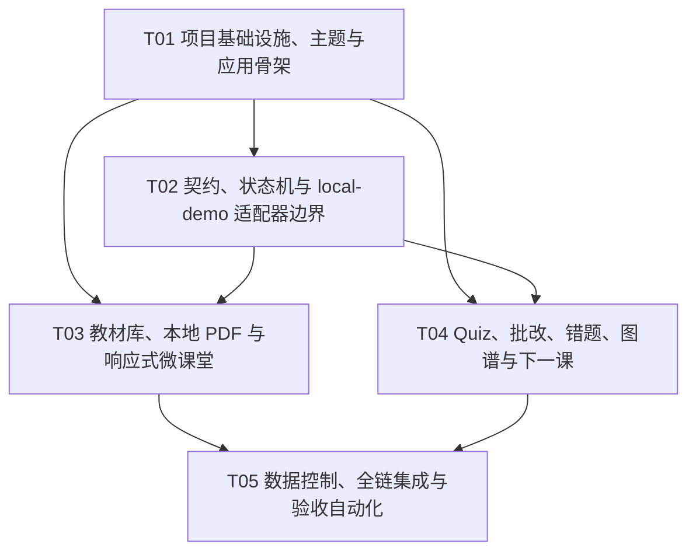

# AI 教育 Web App 本地受控 MVP：实现任务

> 执行顺序：按任务 ID；硬上限 5 个任务。  
> 需求基线：`docs/PRD.md`。架构基线：`docs/ARCHITECTURE.md`。  
> 任务原则：每个任务按功能/层次分组且至少涉及 3 个文件；T01 集中所有基础设施、入口与依赖；实现不得创建真实 commit 假象。

## 1. 依赖包

建议在 T01 锁定实际兼容的小版本并提交 lockfile；以下为最低主版本范围：

```text
运行依赖
- react@^18.3.0: UI framework
- react-dom@^18.3.0: React DOM renderer
- react-router-dom@^6.28.0: SPA routing
- @mui/material@^6.0.0: accessible UI primitives and theming
- @mui/icons-material@^6.0.0: status/action icons paired with text
- @emotion/react@^11.13.0: MUI styling runtime
- @emotion/styled@^11.13.0: MUI styled API
- pdfjs-dist@^4.10.0: browser-local PDF rendering and text layer
- zod@^3.24.0: runtime boundary/schema validation
- @xyflow/react@^12.3.0: knowledge graph canvas

开发依赖
- vite@^6.0.0: build/dev server
- typescript@^5.7.0: static typing
- @vitejs/plugin-react@^4.3.0: React Fast Refresh/build integration
- eslint@^9.17.0: lint runner
- @eslint/js@^9.17.0: base lint rules
- typescript-eslint@^8.18.0: TypeScript lint rules
- eslint-plugin-react-hooks@^5.1.0: Hooks correctness
- eslint-plugin-react-refresh@^0.4.16: Vite React export checks
- vitest@^2.1.0: unit/integration tests
- jsdom@^25.0.0: component test DOM
- @testing-library/react@^16.1.0: behavior-first component testing
- @testing-library/user-event@^14.5.0: realistic interaction testing
- @testing-library/jest-dom@^6.6.0: accessible DOM assertions
- @playwright/test@^1.49.0: cross-browser responsive E2E
- axe-core@^4.10.0: accessibility checks used by E2E helper
```

不安装 Tailwind、Redux/Zustand、后端框架、模型 SDK 或 CloudBase SDK。首版无需它们；未来 adapter 接入时再用真实需求驱动依赖。

## 2. 任务总览

| Task ID | Task Name | Dependencies | Priority | 主要 PRD 映射 |
|---|---|---|---|---|
| T01 | 项目基础设施、主题与应用骨架 | 无 | P0 | P0.1、P0.7；7.4(11–12)；10.1–10.4 |
| T02 | 契约、状态机与 local-demo 适配器边界 | T01 | P0 | P0.1、P0.4–P0.8；7.2(5–10)；8.1、8.3 |
| T03 | 教材库、本地 PDF 与响应式微课堂 | T01、T02 | P0 | P0.2、P0.3、P0.8；7.1(1–4)；7.4(11–14) |
| T04 | Quiz、可解释批改、错题、图谱和下一课闭环 | T01、T02 | P0 | P0.4–P0.7；7.1、7.2、7.3 |
| T05 | 数据控制、全链集成与验收自动化 | T03、T04 | P0 | P0.1、P0.7、P0.8；第 7 节全部验收项 |



T03 与 T04 在 T02 完成后可并行；T05 只做最终整合与门禁验证，避免过长线性依赖。

## 3. 可执行任务

### T01 — 项目基础设施、主题与应用骨架

- **优先级**：P0
- **依赖**：无
- **目标**：建立可启动、可构建、可测试的 React/TypeScript 单页应用，把依赖、配置、入口、路由、MUI theme、Editorial tokens 与三档响应式壳集中落地。
- **Source Files**：
  - `package.json`
  - `package-lock.json`
  - `index.html`
  - `vite.config.ts`
  - `tsconfig.json`
  - `tsconfig.app.json`
  - `tsconfig.node.json`
  - `eslint.config.js`
  - `playwright.config.ts`
  - `src/main.tsx`
  - `src/App.tsx`
  - `src/vite-env.d.ts`
  - `src/app/AppRouter.tsx`
  - `src/app/AppProviders.tsx`
  - `src/app/routes.ts`
  - `src/theme/theme.ts`
  - `src/theme/tokens.css`
  - `src/theme/global.css`
  - `src/theme/typography.css`
  - `src/components/AppShell.tsx`
  - `src/components/ModeBanner.tsx`
  - `src/components/SkipLink.tsx`
  - `src/test/setup.ts`
  - `src/test/renderWithProviders.tsx`
- **实现要求**：
  1. 使用 Vite + React 18 + TypeScript + MUI + CSS Modules/variables；不引入 Tailwind。
  2. MUI theme 以 `#F6F1E7/#20231F/#2F6B57/#D96C3B/#E8C35A` 为唯一色板 token；状态同时用图标和文本。
  3. 设置霞鹜文楷、IBM Plex Sans 的本地授权字体入口与系统回退；若仓库没有许可证文件，先只用 fallback，不下载/捆绑未知来源字体。
  4. `AppShell` 提供桌面导航、移动导航、skip link、main landmark；学习桌细节留给 T03。
  5. 在 `ModeBanner` 永久可见地标明“本地受控演示 / 结果为候选 / 尚未连接正式宿主”。
  6. 构建配置为 PDF worker 与 CSP 预留同源资源路径；不要启用 PWA/service worker。
  7. 增加 `dev/build/lint/test/test:e2e` scripts。
- **验收标准**：
  - `npm ci && npm run lint && npm test -- --run && npm run build` 成功；
  - `/`、`/library`、`/classroom`、`/wrong-questions`、`/knowledge-graph`、`/settings` 路由可打开空壳并有明确空状态；
  - 360/768/1280 三档无横向滚动，skip link 和主要导航可全键盘操作；
  - theme 中不存在第二套硬编码核心色；`ModeBanner` 在桌面和手机都可见；
  - 页面没有“已保存/已归档/已掌握/已入队”等事实型假状态。
- **PRD 映射**：P0.1；P0.7 的能力诚实；7.4(11–12)；10.1、10.2、10.3、10.4。

### T02 — 契约、状态机与 local-demo 适配器边界

- **优先级**：P0
- **依赖**：T01
- **目标**：先固定领域结构与 adapter ports，再建立 proposal-only、本地确定性的演示引擎；所有 UI 功能只能通过端口访问教学能力。
- **Source Files**：
  - `src/contracts/common.ts`
  - `src/contracts/identity.ts`
  - `src/contracts/textbook.ts`
  - `src/contracts/learning.ts`
  - `src/contracts/quiz.ts`
  - `src/contracts/evidence.ts`
  - `src/contracts/wrongQuestion.ts`
  - `src/contracts/knowledgeGraph.ts`
  - `src/contracts/nextLesson.ts`
  - `src/contracts/registration.ts`
  - `src/contracts/schemas.ts`
  - `src/contracts/errors.ts`
  - `src/adapters/ports/EducationCenterAdapter.ts`
  - `src/adapters/ports/HostCommitPort.ts`
  - `src/adapters/ports/LocalDocumentPort.ts`
  - `src/adapters/ports/SpeechPort.ts`
  - `src/adapters/local-demo/LocalDemoEducationCenterAdapter.ts`
  - `src/adapters/local-demo/LocalDemoProposalEngine.ts`
  - `src/adapters/local-demo/LocalDemoIdempotencyStore.ts`
  - `src/adapters/local-demo/UnavailableHostCommitAdapter.ts`
  - `src/adapters/local-demo/localDemoFixtures.ts`
  - `src/adapters/future/adapterContracts.ts`
  - `src/config/capabilityManifest.ts`
  - `src/config/contentPolicy.ts`
  - `src/config/runtime.ts`
  - `src/state/LearningSessionProvider.tsx`
  - `src/state/learningSessionReducer.ts`
  - `src/state/learningSessionMachine.ts`
  - `src/state/selectors.ts`
  - `src/state/sessionStorage.ts`
  - `src/services/MaterialBoundaryService.ts`
  - `src/services/SafetyPolicyService.ts`
  - `src/services/hash.ts`
  - `src/services/clock.ts`
  - `src/components/ProposalBadge.tsx`
  - `src/components/CapabilityStatus.tsx`
  - `src/components/SafeText.tsx`
  - `src/components/ErrorState.tsx`
  - `tests/unit/contracts.test.ts`
  - `tests/unit/reducer.test.ts`
  - `tests/unit/localDemoAdapter.test.ts`
  - `tests/unit/safetyPolicy.test.ts`
- **实现要求**：
  1. 用 Zod 在 adapter 边界校验命令/响应；类型实现 `ARCHITECTURE.md` 第 4 节不变量。
  2. `LocalDemoEducationCenterAdapter` 统一返回 `executionMode=local-demo`、`proposalOnly=true`、`schedulerAuthority=kernel-10`、`formalKernelRouteActivated=false`、`persistenceState=not-submitted`。
  3. `LocalDemoProposalEngine` 使用固定原创 fixtures + 确定性模板；不声称实际调用 AI 或正式 `kernel-10`。内置演示单元可以完整教学；任意 PDF/文本只能生成“通用分步支架”并明确局限。
  4. `UnavailableHostCommitAdapter.commit()` 必须稳定返回 `HOST_COMMIT_UNAVAILABLE`，不得生成 `commitId`/committed receipt；P0 UI 不暴露提交按钮。
  5. learner 状态以 `workspaceId::learnerId` 为键；切换 learner 触发清理 effect。PDF 正文、选区和原始作答不进 sessionStorage。
  6. 实现内存幂等：同 key+同 hash 复用同 proposal；同 key+异 hash 拒绝；旧 `baseContextVersion` 拒绝。
  7. 能力清单强制：25/34 false；26/37 HOLD 且不可路由；35/36 merged/inactive；未知能力 deny。
  8. 安全策略对危险内容和紧急信号 fail-closed；所有材料始终作为 untrusted data，`SafeText` 不解析 HTML。
  9. 教学门禁：无复述不得 L3、无迁移不得 L4、低于 L3 不推进同链、R10 优先 P9、下一课恰好一个主路径。
- **验收标准**：
  - 端口接口编译通过，页面/application 层无具体 adapter 的散乱 import（只由 `AppProviders` 注入）；
  - 测试证明 local-demo 对任何命令都不能到达 `committed/submitted`；
  - 相同 key/相同 payload 返回相同 `proposalId`，不重复产生候选；相同 key/不同 payload 返回 `IDEMPOTENCY_CONFLICT`；旧版本返回 `VERSION_CONFLICT`；
  - 25/34 关闭、26/37 不可路由、35/36 未激活均有 schema 与测试；
  - learner A 哨兵状态不会被 learner B selector、导出模型或 adapter command 读取；
  - 至少 30 个门禁 case 中无证据判 L3/L4、低于 L3 同链推进、把“学完了”当证据的违规为 0；
  - 紧急安全样例不返回普通批改/错因/下一课，仅返回安全拦截状态。
- **PRD 映射**：P0.1、P0.4、P0.5、P0.6、P0.7、P0.8；7.2(5–7)；7.3(8–10)；8.1、8.3。

### T03 — 教材库、本地 PDF 与响应式微课堂

- **优先级**：P0
- **依赖**：T01、T02
- **目标**：实现从教材选择到分步微课堂的前半程，包括原创演示教材、会话内本地 PDF、选区引用、文字难题、一次一个动作、前端步骤动效和本地 TTS。
- **Source Files**：
  - `src/features/onboarding/ConsentPage.tsx`
  - `src/features/onboarding/LearnerSwitcher.tsx`
  - `src/features/library/LibraryPage.tsx`
  - `src/features/library/TextbookPicker.tsx`
  - `src/features/library/RightsStatus.tsx`
  - `src/features/classroom/ClassroomPage.tsx`
  - `src/features/classroom/DesktopLearningDesk.tsx`
  - `src/features/classroom/MobileTaskRail.tsx`
  - `src/features/classroom/ClassroomHeader.tsx`
  - `src/features/reader/DemoTextbookReader.tsx`
  - `src/features/reader/LocalPdfImporter.tsx`
  - `src/features/reader/PdfReader.tsx`
  - `src/features/reader/ContextSelection.tsx`
  - `src/features/lesson/LearningPrompt.tsx`
  - `src/features/lesson/MicroLesson.tsx`
  - `src/features/lesson/LessonStepCard.tsx`
  - `src/features/lesson/RestatementCheck.tsx`
  - `src/features/lesson/TtsControls.tsx`
  - `src/adapters/pdfjs/PdfJsLocalDocumentAdapter.ts`
  - `src/adapters/pdfjs/pdfWorker.ts`
  - `src/adapters/speech/BrowserSpeechAdapter.ts`
  - `tests/unit/pdfLifecycle.test.ts`
  - `tests/integration/coreJourney.test.tsx`
  - `tests/integration/learnerIsolation.test.tsx`
  - `tests/fixtures/local-selection-sample.pdf`
- **实现要求**：
  1. 进入教材前完成监护人本地同意与 active learner 选择；未就绪 fail-closed。
  2. 教材卡展示年级/学科/版本/来源/授权状态；只允许 `authorized-demo` 与 `local-user-owned` 打开正文，catalog-only 仅展示目录。
  3. 演示教材、Quiz 与图谱 fixture 必须原创/脱敏，并带 source attribution 与 license note；不导入第三方教材正文、封面或下载链接。
  4. PDF 只允许本地 File；验证 magic bytes、50MB/300页上限；worker 同源打包；`isEvalSupported:false`、`enableXfa:false`；不支持 URL、附件、脚本、外链执行。
  5. Canvas + text layer 实现页内选择，生成锚点与 digest；显示“本机打开，本次会话使用”。换 learner、退出、关闭文件时销毁 document/worker/object URL/选区。
  6. 教材/PDF/题干作为材料交 `MaterialBoundaryService`；React 文本节点呈现，不用 `dangerouslySetInnerHTML`。
  7. 桌面是 18/54/28 非对称三栏；手机是教材主画布 + sticky 底部任务轨道；键盘/抽屉展开不丢选区与草稿。
  8. 微课堂只显示当前一步；支持换讲法、举例、没听懂与复述；未满足复述检查不可进入 Quiz。
  9. TTS 使用浏览器 Speech API，支持播放/暂停/继续/静音，浏览器不支持时显示文字 fallback；步骤/learner/路由切换时 cancel。
  10. 本地增强版渲染图片拍题/OCR 控件，必须同源加载 Worker/WASM/语言包、校对后再送入课堂，且明确“不上传、不保存”；微课堂动效仍标明为前端演示，不能显示 OpenMAIC 已启用。
- **验收标准**：
  - 从首次进入到打开演示单元关键选择 ≤5 步；演示教材与本地 PDF 均能在 ≤3 次交互进入首张步骤卡；
  - 网络监听证明 PDF 字节、路径、选区正文没有请求外发，也未落入 localStorage/sessionStorage/IndexedDB/cache；
  - 关闭文档、刷新或切换 learner 后无法从 UI/adapter state 读回 PDF 与选区；
  - 360/768/1280 无内容遮挡、横向滚动或关键按钮不可达；核心交互可用键盘完成；
  - Speech API 支持时播放/暂停/静音可用，不支持时仍有完整文字；
  - OCR 图片输入仅接受 JPG/PNG，边界失败时 fail-closed；真实浏览器监听证明识别阶段没有外部请求；“OpenMAIC 已运行/已启用”文案数量为 0；
  - 无授权/catalog-only 条目无法查看正文；来源和版本清晰可见；
  - learner A 的 PDF 选区与草稿不会在 learner B 出现。
- **PRD 映射**：P0.1、P0.2、P0.3、P0.8；7.1(1–4)；7.4(11–14)；8.1、8.2、8.3；10.2、10.3、10.4。

### T04 — Quiz、可解释批改、错题、图谱和下一课闭环

- **优先级**：P0
- **依赖**：T01、T02
- **目标**：实现核心旅程后半程；从题目曝光到证据、批改、8 字段错题候选、知识图谱和唯一下一课 proposal，全程保持 candidate truthfulness。
- **Source Files**：
  - `src/features/quiz/QuizPanel.tsx`
  - `src/features/quiz/QuizQuestion.tsx`
  - `src/features/quiz/StepAnswerInput.tsx`
  - `src/features/quiz/GradingReview.tsx`
  - `src/features/wrong-questions/WrongQuestionPage.tsx`
  - `src/features/wrong-questions/WrongQuestionCandidateCard.tsx`
  - `src/features/wrong-questions/WrongQuestionFilters.tsx`
  - `src/features/knowledge-graph/KnowledgeGraphPage.tsx`
  - `src/features/knowledge-graph/KnowledgeGraphCanvas.tsx`
  - `src/features/knowledge-graph/FocusedKnowledgePath.tsx`
  - `src/features/next-lesson/NextLessonProposal.tsx`
  - `tests/integration/candidateTruthfulness.test.tsx`
  - `tests/unit/localDemoAdapter.test.ts`（扩展闭环 cases）
- **实现要求**：
  1. 每课 3–5 题，至少选择、填空、分步作答；实际展示时记录 `QuizExposure`，提交时记录原答、步骤、用时、提示次数。
  2. `GradingReview` 逐题展示对错 candidate、原答、依据、思路反馈、证据缺口与 R1–R11 候选；不以“粗心”为主错因。
  3. 掌握等级使用明确的 proposal 文案；证据不足显示“暂无法判断”，并展示缺少复述/迁移证据。
  4. 错题卡固定 8 字段：题目、原答与思路、R 错因、正确入口、避免方法、识别线索、是否反复、复测安排；至少实现学科/章节/错因/复测状态筛选。
  5. P0 错题状态固定为“待登记/尚未提交”，不提供伪造的归档/入队动作；`HostCommitPort` unavailable 信息可展开查看。
  6. 图谱事实节点仅来自原创课程 fixture；显示知识点、前置关系、证据候选状态、关联错题与 source refs。AI 内容以 visually distinct candidate overlay 呈现，不能写回事实节点。
  7. 桌面提供可缩放 graph canvas；手机默认可访问列表“当前点—前置—下一步”，完整画布为次入口。
  8. 下一课 proposal 展示唯一 `primaryPath` P1–P9、至多一个辅路径、证据/理由、5–30分钟动作和暂不做什么；R10/状态差时 2–10分钟且 P9。
  9. 收尾调用 `prepareRegistration` 形成组件24形状的 registration proposal，但只显示可查看/本地导出候选；不得调用 commit。
- **验收标准**：
  - 演示单元可完成 4 题且包含三种题型；每条反馈可定位 exposure、原答和依据；
  - 至少 50 个错题 fixture/property cases 的 8 字段完整率 ≥95%，主错因“粗心”为 0；
  - 无复述 case 显示“暂无法判断”或不高于 L2；无迁移 case 不出现 L4；低于 L3 case 不推荐同链新内容；R10 case 的主路径为 P9；
  - 任一收尾结果只有一个主路径，理由至少引用 1 条 evidence ref 或明确“证据不足”；
  - 图谱能显示前置边与关联错题；candidate 节点不会改变事实 fixture；移动默认聚焦路径列表可键盘/读屏使用；
  - DOM 和可访问名称中，“已归档/已进入复测队列/已掌握/已保存”在无真实 receipt 时出现次数为 0；
  - `UnavailableHostCommitAdapter.commit` 调用次数为 0，registration proposal 显示 `persistenceIntent=propose`。
- **PRD 映射**：P0.4、P0.5、P0.6、P0.7；7.1(1、4)；7.2(5–7)；7.3(8–10)；4.4、4.5、5.1。

### T05 — 数据控制、全链集成与验收自动化

- **优先级**：P0
- **依赖**：T03、T04
- **目标**：把所有页面接成完整核心旅程，补齐数据导出/删除、退出、安全负例、CSP 与跨浏览器 E2E，最终对 PRD 验收项给出可执行证据。
- **Source Files**：
  - `src/features/data-control/DataControlPage.tsx`
  - `src/services/DataControlService.ts`
  - `src/app/AppRouter.tsx`（集成）
  - `src/app/AppProviders.tsx`（adapter 装配）
  - `src/features/classroom/ClassroomPage.tsx`（闭环集成）
  - `index.html`（CSP meta/安全基线；部署 header 优先）
  - `vite.config.ts`（生产安全配置）
  - `tests/e2e/desktop-core-journey.spec.ts`
  - `tests/e2e/mobile-core-journey.spec.ts`
  - `tests/e2e/local-pdf.spec.ts`
  - `tests/e2e/safety-and-a11y.spec.ts`
  - `tests/integration/coreJourney.test.tsx`（最终集成）
  - `tests/integration/learnerIsolation.test.tsx`（最终集成）
  - `tests/integration/candidateTruthfulness.test.tsx`（最终集成）
- **实现要求**：
  1. `AppProviders` 只注入 `LocalDemoEducationCenterAdapter`、`PdfJsLocalDocumentAdapter`、`BrowserSpeechAdapter`、`UnavailableHostCommitAdapter`；运行时不可由 URL/用户输入切换 host 模式。
  2. 串联完整旅程，并为加载、空数据、未选 PDF、无授权、能力未启用、生成中、可取消、失败重试、版本冲突、待提交、安全拦截设计状态。P0 不伪造提交成功/同步中。
  3. 数据导出只包含当前 learner 的本地结构化候选与来源，不包含 PDF 字节/全文；文件名使用化名/稳定 ID，不使用真实姓名。导出前显示范围说明。
  4. 删除流程二次确认后清空 reducer、sessionStorage、PDF、选区、TTS 与 object URL；读回验证为空后只显示“本地会话数据已删除”，不声称服务端/云端删除。
  5. 实现会话退出：停止语音、销毁文档、清除敏感状态并返回 consent/onboarding。
  6. CSP 按架构设置为 self-only，worker/blob 仅满足 PDF；`connect-src 'none'` 适用于 P0 生产构建。所有动态内容用文本节点。
  7. Playwright 覆盖 desktop 1280、tablet 768、mobile 360；Chromium 和 WebKit 关键路径，并配置 Edge channel 的本地人工/CI 可选项目。
  8. E2E 捕获 network/storage/console，证明 PDF 无上传、日志无全文/原答、无跨 learner 泄露、无误导状态；运行 axe 并补手工键盘测试清单。
  9. 将 Phase 3 能力事实作为 UI contract assertions：25/34 false、26/37 不路由、35/36 未激活、正式 registry/kernel route/state write 均 false。
- **验收标准**：
  - 桌面 1280 与手机 360 各完整跑通：选教材 → 读演示课/导入本地 PDF → 教材上下文或文本难题 → 微课堂 → 3–5题 Quiz → 批改 → 8字段错题候选 → 图谱 → 唯一下一课 proposal，阻断错误 0；
  - 768 视口同样无遮挡、横向滚动和不可达按钮；Chromium/WebKit 自动化通过，Edge/Safari 最近两主版本人工 smoke 有记录；
  - 核心旅程一次只呈现一个当前动作；下一课主路径数恒为 1；
  - PDF 内容外发请求为 0；跨 learner DOM/导出/命令泄露为 0；提示注入、XSS、危险内容、越权引用负例全部拒绝或安全降级；
  - 未收到正式 receipt 时，误导性“已保存/已掌握/已归档/已入队” UI 违规为 0；
  - 版本冲突展示重新加载动作，幂等冲突不自动换 key 重试；
  - 监护人能导出和删除当前 learner 本地数据；删除后 storage/state/PDF/TTS 验证为空且文案准确；
  - `npm run lint && npm test -- --run && npm run build && npm run test:e2e` 全部通过。
- **PRD 映射**：P0.1–P0.8；7.1(1–4)；7.2(5–7)；7.3(8–10)；7.4(11–14)；8.1–8.3；10.4。

## 4. Shared Knowledge（工程师必须共同遵守）

1. **权威边界**：`kernel-10` 是唯一调度权威；local-demo 仅输出契约化演示 proposal，不声称调用正式 kernel。Agent/adapter 都不能 commit。
2. **唯一真实提交者**：组件24是业务登记门面，教育中心宿主执行物理 commit。P0 的 `HostCommitPort` 固定 unavailable，禁止伪 receipt。
3. **状态诚实**：仅正式 `status=committed` 回执可显示“已保存/已归档”；进入复测队列还需真实 `queueUpdate.status=applied`。P0 统一使用“候选、待登记、尚未提交”。
4. **身份键**：任何状态、命令、导出与删除均以 `workspaceId + learnerId` 隔离；`sessionId` 不是身份。切换 learner 先停止 TTS、销毁 PDF、清空材料/草稿。
5. **并发控制**：所有 proposal command 带 `idempotencyKey` 与 `baseContextVersion`。同 key/同 hash 去重；同 key/异 hash 冲突；旧版本重新 bootstrap，禁止自动覆盖。
6. **证据规则**：证据追加、快照可重建、报告只是视图；无复述不得 L3，无迁移不得 L4；“学完了/我会了”不是证据；不足写“暂无法判断”。
7. **错题规则**：8 字段不可重命名或删减；R1–R11 主错因不使用“粗心”；信息不足明确标记，不虚构。
8. **下一课规则**：主路径恰好一个 P1–P9，辅路径最多一个；低于 L3 不推同链；R10/状态差由 P9 覆盖，任务缩短至 2–10 分钟。
9. **材料不可信**：教材、PDF、题干、答案均只作为 data；不解析成指令，不 eval，不插 HTML，不自动打开链接。所有输出需过 Zod 与 `SafeText`。
10. **PDF 隐私**：只接本地 File；不上传、不长期保存、不入 cache/IndexedDB/localStorage/sessionStorage；PDF worker 同源；关闭 eval/XFA；关闭/切换/退出立即销毁。
11. **能力状态**：25/34 flag false；26/37 HOLD；35/36 merged but inactive；正式 registry write、kernel route activation、physical state write 都是 false；未知能力 deny。
12. **浏览器 TTS**：只读现有等价文字；支持播放/暂停/静音；不可用时安全降级；TTS 行为不是学习证据。
13. **时间和日志**：时间统一 RFC 3339 含时区；日志只记 request/correlation ID、状态、耗时、Schema/策略版本，不记 token、PDF、完整原答、姓名学校或路径。
14. **设计系统**：MUI theme 是 token 单一事实源；色板与字体按架构；Editorial 而非通用后台卡片；状态不用颜色单独表达；360px 起无横向滚动。
15. **未来接入**：CloudBase/BFF 与 OpenMAIC 只能新建 adapter 实现既有 port；页面和 reducer 接口不因供应方改变。OpenMAIC 在组件37出 HOLD 前不得进入主链。

## 5. PRD 覆盖检查

| PRD 要求 | 实现任务 | 核心验收证据 |
|---|---|---|
| P0.1 响应式与身份边界 | T01、T02、T03、T05 | 360/768/1280 E2E；learner 哨兵隔离 |
| P0.2 教材选择与合规阅读 | T03、T05 | rights gate；本地 PDF 无网络/持久化 |
| P0.3 上下文聊天与微课堂 | T02、T03 | ≤3 次交互；单动作；复述；TTS fallback |
| P0.4 Quiz 与可解释批改 | T02、T04 | 曝光/原答/计时/提示/依据链；证据门禁 |
| P0.5 错题本 | T02、T04 | 8 字段 ≥95%；四维筛选；候选状态 |
| P0.6 图谱与下一课 | T02、T04 | source refs；事实/候选分层；唯一 P1–P9 |
| P0.7 C2.1 接入门禁 | T01、T02、T04、T05 | proposal-only；host unavailable；flags/HOLD assertions |
| P0.8 未成年人安全 | T02、T03、T05 | 同意/退出/导出/删除；紧急信号阻断；安全负例 |
| Editorial / 三栏 / 移动轨道 | T01、T03 | 主题快照、响应式 E2E、键盘测试 |
| 本地图片 OCR | T03、T05 | MIME/扩展名/magic bytes/像素边界；同源资源；校对确认；无外部请求/持久化 |
| 未来 CloudBase/OpenMAIC | T02 | port/future contract 存在，但没有运行时依赖或路由 |
